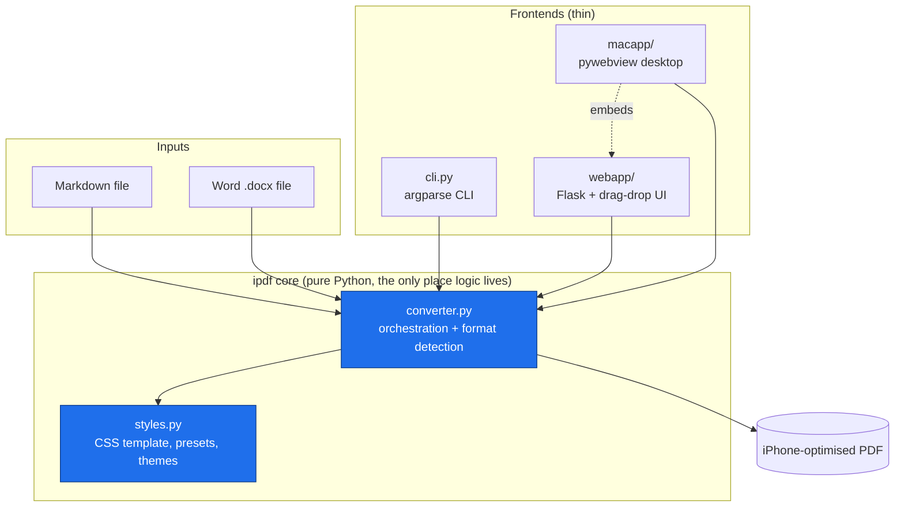
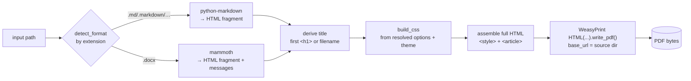
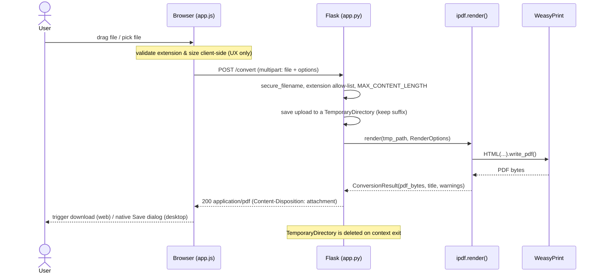
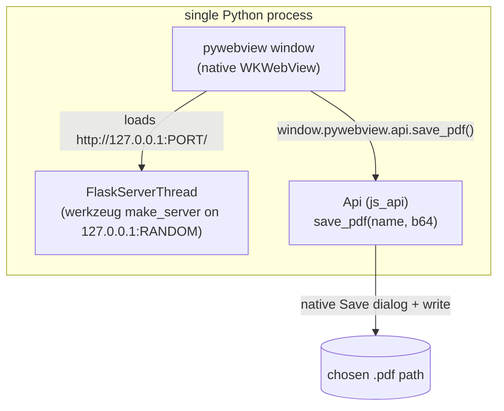
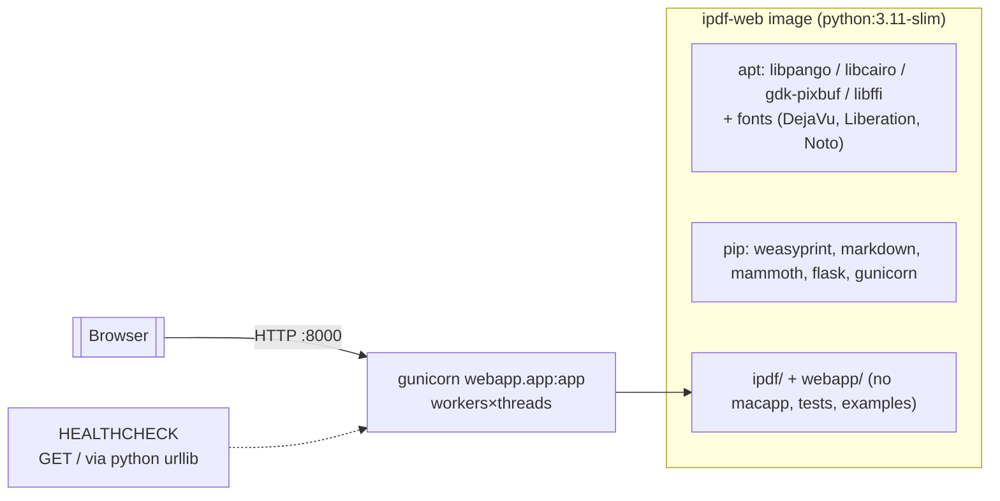

# ipdf — Architecture & Maintainer's Guide

This document is the map a human maintainer needs to safely change `ipdf`. It
covers what the pieces are, how a document flows through them, the design
decisions behind the typography, how the three frontends (CLI, web, macOS) are
wired, how the container is built, and — most importantly — the **gotchas** that
will bite you if you don't know they're there.

> TL;DR mental model: there is **one converter** (`ipdf/`) and **three thin
> shells** around it (CLI, Flask web app, macOS desktop app). Everything
> interesting happens in the converter; the shells just feed it bytes and
> options and hand back a PDF.

---

## 1. Scope & responsibilities

`ipdf` turns a **Markdown** or **Word `.docx`** document into a **PDF tuned for
reading on an iPhone**: a small, phone-shaped page, a screen-friendly font at a
size that becomes large under "fit to width", short line length, and preserved
styling (headings, bold/italic, lists, tables, code, quotes, images, links).

It is deliberately a *transformation* tool, not an editor or a store. Nothing is
persisted; every conversion is stateless.

---

## 2. System context



Key relationship to internalise: **the macOS app embeds the web app**, and the
web app embeds the core. So a change to the converter ripples to all three; a
change to the web UI also changes the macOS app (it serves the same HTML).

---

## 3. Repository layout

```
ipdf/                     # ── CORE: the converter (importable library)
  __init__.py             #     public API: convert(), ConversionError, presets
  converter.py            #     pipeline: detect → parse → assemble HTML → render
  styles.py               #     CSS template (string.Template), presets, themes
  cli.py                  #     argparse command-line interface
  __main__.py             #     `python -m ipdf`

webapp/                   # ── WEB frontend (Flask)
  app.py                  #     routes: / , /api/options , /convert
  templates/index.html    #     single page; embeds option metadata as JSON
  static/style.css        #     dark app chrome
  static/app.js           #     drag-drop, settings panel, fetch+download / native save
  requirements.txt

macapp/                   # ── macOS desktop app (pywebview around webapp)
  app.py                  #     Flask-in-a-thread + JS↔Python save bridge
  launcher.py             #     py2app entry script
  setup_py2app.py         #     .app bundle build config
  requirements.txt

tests/                    # unittest suites (core, web, mac)
examples/sample.md        # demo document
docs/ARCHITECTURE.md      # this file
Dockerfile                # web service image
docker-compose.yml
pyproject.toml            # packaging; extras: [web], [mac]
```

---

## 4. The conversion pipeline

Everything funnels through `ipdf.converter.render()`. The shape is always the
same regardless of input format or frontend:



Why **HTML as the intermediate representation**? Because the readability
requirements are all *layout*: page size, margins, font, line length,
pagination. CSS — specifically WeasyPrint's `@page` — expresses those directly
and declaratively. Reimplementing that against a PDF primitive library
(ReportLab et al.) would mean hand-rolling a layout engine.

### 4.1 Format detection

`detect_format()` switches purely on **file extension** (`MARKDOWN_SUFFIXES`,
`DOCX_SUFFIXES`). It does **not** sniff content. This matters for the web/mac
shells: they save the upload to a temp file *preserving its extension* so this
detection works (see §9 gotchas).

### 4.2 Markdown path

`python-markdown` with extensions `extra, sane_lists, smarty, admonition, toc`.
`extra` brings tables, fenced code, footnotes, definition lists, attribute
lists. `smarty` produces curly quotes / em-dashes — a readability nicety, but
see the gotcha about it touching code-ish text.

### 4.3 DOCX path

`mammoth` maps Word's *semantic* styles → clean HTML (`<h1>`, `<strong>`,
`<em>`, `<ul>`/`<ol>`, `<table>`) and **inlines images as `data:` URIs**. It is
intentionally lossy: it ignores Word's direct visual formatting (specific
fonts, colours, sizes) in favour of structure — which is exactly what we want,
because we re-style everything for the phone. `mammoth` returns *messages*
(unrecognised styles etc.); we surface these as non-fatal warnings.

### 4.4 Styling & assembly

`build_css()` renders the CSS from the resolved options. The document is then
`<style>…</style>` + `<article>…fragment…</article>`. There is no external CSS
file at render time — the stylesheet is inlined so the HTML is fully
self-contained before it reaches WeasyPrint.

### 4.5 Render

`weasyprint.HTML(string=html, base_url=<source dir>).write_pdf()`. The
`base_url` is what lets *relative* image paths in Markdown resolve. It is also
the crux of a security gotcha (§9.3).

---

## 5. Why these typographic defaults (the iPhone-readability rationale)

The single load-bearing insight: **people read PDFs on phones with "fit to
width".** Under fit-to-width the *absolute* page size is irrelevant — the OS
scales the page so its width fills the screen. What survives scaling is the
**ratio** of font size to page width.

So the design fixes that ratio:

```
apparent_text_size ∝ font_size / page_width
```

- Default page width **3.5 in (252 pt)**, body font **11 pt** → ratio ≈ `0.044`.
  On a ~390 px-wide phone viewport that lands the text at roughly 16–17 px
  apparent — a comfortable reading size — without the user pinching.
- Page **height** is derived from each iPhone model's **screen aspect ratio**
  (~19.5∶9 ≈ 2.166 for modern models) so one PDF page ≈ one screenful in
  portrait; paging through the PDF feels like scrolling screens.
- The narrow column yields a **~35–45 character line measure**, the readable
  range for a single-hand phone column. Hyphenation (`hyphens: auto`, via
  Pyphen) keeps the ragged right edge tidy at that width.
- **Sans-serif by default** — at small sizes on a phone's pixel density, a clean
  sans (Liberation Sans / DejaVu Sans as the bundled fallbacks) is crisper than
  serif.
- Long things that would overflow the narrow page are forced to wrap: code
  blocks use `white-space: pre-wrap`, and `overflow-wrap: break-word` catches
  long URLs/words. **Nothing is clipped off the page edge.**

Presets (`iphone`, `iphone-mini`, `iphone-max`, `iphone-se`) mostly vary width
and the derived height; `iphone-max` also bumps the font a touch. The absolute
inches are arbitrary — only the ratios carry meaning — but inches keep the
`@page size` declaration human-readable.

---

## 6. Styling subsystem (`styles.py`)

- **`_CSS_TEMPLATE` is a `string.Template` ($-substitution), not an f-string or
  `str.format`.** This is deliberate: CSS is full of literal `{ }` braces, which
  would require doubling under `format`/f-strings and make the stylesheet
  unreadable. With `$name` placeholders the CSS stays copy-pasteable. **Gotcha:**
  every literal `$` you ever add to the CSS must be written `$$`, and every
  tunable must be passed to `.substitute()` or it raises `KeyError`.
- **`PAGE_PRESETS`** — width/height (inches) + default font size per model.
- **`FONT_STACKS`** — `sans` / `serif` / `mono`, each a CSS stack that prefers
  Apple system fonts (for when the PDF is *viewed*) but **embeds** whatever the
  rendering machine actually has (the bundled Docker image ships DejaVu +
  Liberation). The chosen glyphs are subset-embedded into the PDF by WeasyPrint,
  so the file is portable.
- **`THEMES`** — `light` / `dark` / `sepia`, each a flat dict of the ~12 colours
  the stylesheet needs. `dark`/`sepia` set the `@page` background so the colour
  bleeds to the page edge (good for night reading).

---

## 7. CLI (`cli.py`)

`argparse` over `RenderOptions`. Notable: `--page-size` accepts `WxH[unit]`
(`3.5x7.6in`, `90x195mm`) via `_parse_page_size`, overriding the preset. Exit
codes: `0` ok, `2` known `ConversionError` (bad input/options), `1` unexpected.

---

## 8. Web frontend (`webapp/`)

A single page + three routes. The settings panel is built **from metadata the
server emits**, so option lists can't drift between client and server.



- **`/`** renders `index.html`, embedding `_choices()` as `window.IPDF_CHOICES`.
- **`/api/options`** serves the same metadata as JSON (handy for testing/automation).
- **`/convert`** is the workhorse. Validation order matters: presence → filename
  → extension allow-list → option parsing → render. Errors become JSON via the
  `400`/`413` handlers so the client can show a useful message.
- Client-side checks (size/extension) are **UX only**; the server re-validates
  everything. Never rely on the browser checks.

---

## 9. macOS app (`macapp/`)

The desktop app does **not** reimplement anything. It:



1. Runs the **same Flask app** on a private random localhost port in a daemon
   thread (`FlaskServerThread`, backed by a real `werkzeug` server — not the dev
   server's `app.run`).
2. Opens a native window (`pywebview` → WKWebView on macOS) pointed at that URL.
3. Injects `window.pywebview.api`. The shared `app.js` detects it
   (`isDesktop()`) and, instead of a browser blob-download, base64-encodes the
   PDF and calls `api.save_pdf()`, which opens a **native Save dialog** and
   writes the file.

**Lazy `webview` import** is load-bearing: `import webview` happens *inside*
`Api.save_pdf` and `main()`, never at module top level, so `macapp.app` imports
fine on headless/CI machines without a GUI backend. The non-GUI logic
(`write_pdf`, `find_free_port`, `FlaskServerThread`) is unit-tested that way.

Why not Tauri/Electron? The conversion is Python + WeasyPrint; a Rust/JS shell
would still have to bundle and drive a Python sidecar. pywebview reuses the
converter and the web UI directly — far less machinery for the same UX.

---

## 10. Container & deployment



- **Base:** `python:3.11-slim` (Debian bookworm).
- **The whole point of the apt layer** is WeasyPrint's native libs + fonts. A
  pip-only image builds but every conversion 500s at runtime. This is the
  number-one operational gotcha (§11.1).
- **gunicorn, not the Flask dev server.** The dev server is single-threaded and
  documented as unsuitable for production. `CMD` runs
  `gunicorn webapp.app:app` with worker/thread counts from env vars.
- **Non-root** user (`appuser`, uid 10001). `docker-compose.yml` additionally
  runs the root FS **read-only** with a `/tmp` tmpfs (conversions only need
  ephemeral temp files) and `no-new-privileges`.
- `.dockerignore` excludes `macapp/`, `tests/`, `examples/`, `docs/`, `.git`.

Run:

```bash
docker compose up --build      # → http://localhost:8000
# or
docker build -t ipdf-web . && docker run --rm -p 8000:8000 ipdf-web
```

Tunables (env): `PORT`, `GUNICORN_WORKERS`, `GUNICORN_THREADS`,
`GUNICORN_TIMEOUT`.

---

## 11. Key gotchas & things to pay attention to

> Read this section before touching anything. Most of these have already cost
> someone an afternoon.

### 11.1 WeasyPrint native dependencies (operational #1)
`pip install weasyprint` does **not** install Pango/cairo/GDK-PixBuf. Without
them the import may even succeed but `write_pdf()` fails. The Dockerfile's apt
layer is therefore not optional, and bumping the base image can change package
names (e.g. `libffi7` on bullseye vs **`libffi8`** on bookworm; gdk-pixbuf
package naming has churned across releases). After any base-image bump, do a
real conversion in the container, not just a build.

### 11.2 Fonts must be present at *render* time
WeasyPrint embeds the glyphs it can find on the **build/host** machine, not the
fonts named in the CSS stack. If the image lacks Latin fonts you get tofu
(□□□) or fallback substitution. Hence the explicit `fonts-dejavu` /
`fonts-liberation` / `fonts-noto-core`. CJK/RTL/emoji need additional font
packages — add them if your inputs need them.

### 11.3 SSRF / local-file read via resource fetching (security — HIGH)
WeasyPrint resolves resources referenced by the document (e.g.
``, or worst case `src="file:///etc/passwd"`,
or relative paths against `base_url`). For a **public web deployment** this is a
server-side request forgery / local file disclosure vector: an attacker uploads
Markdown that references internal URLs or local files, and the fetched content
can end up embedded in the returned PDF.

Mitigations (in priority order):
1. **Restrict the fetcher.** Pass a custom `url_fetcher` to `weasyprint.HTML`
   that allows only `data:` URIs (and, if you want remote images, an explicit
   https allow-list) and **blocks `file:` and private/link-local IP ranges.**
   This is the recommended hardening and is currently *documented but not yet
   implemented* — treat it as the top backlog item before exposing the web
   service to untrusted users.
2. Run the container with **egress network policy** denying outbound except what
   you need (defence in depth; pairs well with the read-only FS already set).
3. Keep `base_url` pinned to the per-request temp dir (already done) so relative
   paths can't escape upward — but note this does **not** stop absolute
   `file://`/`http(s)://` URLs.

For the **CLI/desktop** (local, trusted input) this is a non-issue.

### 11.4 Upload size limit ↔ 413
`MAX_CONTENT_LENGTH = 25 MB` in `webapp/app.py`. Exceeding it makes Flask raise
**413**, handled into JSON. If you raise the limit, also revisit gunicorn
`--timeout` (big docs render slowly) and any reverse-proxy body-size cap
(nginx `client_max_body_size`). These three limits must agree or users get
confusing errors at different layers.

### 11.5 Temp-file lifecycle & format detection
The web/mac shells write the upload into a `TemporaryDirectory` **keeping the
original extension**, because the converter detects format by suffix and uses
the directory as `base_url`. Don't "optimise" this into an in-memory buffer
without also rethinking format detection and relative-asset resolution. The temp
dir is cleaned on context exit even on error (it's a `with` block).

### 11.6 `secure_filename` can empty a name
`werkzeug.secure_filename` strips non-ASCII; a fully non-Latin filename (e.g.
all-CJK) can reduce to `""`. The code falls back to `"document"`, but the
**suffix** is taken from the *secured* name — verify the extension survives, or
non-Latin-named `.docx` uploads could be misdetected. Tests cover the common
case; watch this if you localise.

### 11.7 Markdown list nesting is whitespace-sensitive
With `sane_lists`, a sub-list must be indented under the **text** of its parent
item (align past the bullet marker, typically 4 spaces), with the parent's
content on the same line. Under-indenting silently flattens the nested list into
the parent paragraph. This is a python-markdown behaviour, not a bug in `ipdf`;
it surfaced while building `examples/sample.md`.

### 11.8 `smarty` rewrites quotes/dashes
The `smarty` extension turns straight quotes into curly ones and `--`/`---`
into dashes across the **prose**. It's scoped to leave fenced/inline code alone,
but be aware when a document mixes prose and inline technical tokens — review
output if exact punctuation matters.

### 11.9 gunicorn worker/thread sizing & the GIL
Rendering is **CPU-bound** and holds the GIL, so `--threads` mainly overlaps
upload I/O, not render parallelism. For concurrent renders you need
**`--workers`** (separate processes), each of which is memory-hungry (WeasyPrint
+ fonts). Size workers to RAM and CPU, not to expected QPS alone. The default
`2×4` is a small-box starting point.

### 11.10 pywebview specifics (macOS)
- `webview` is imported lazily — keep it that way or headless imports/tests break.
- `create_file_dialog(SAVE_DIALOG, …)` returns a **string in some versions and a
  one-element list/tuple in others**; `Api.save_pdf` handles both — preserve
  that when upgrading pywebview.
- The PDF crosses the JS↔Python bridge as **base64** (the bridge marshals JSON,
  not binary). Fine for ≤25 MB; if you raise the cap, this doubling is a memory
  consideration.
- HTML5 file-drop into WKWebView works on current macOS/pywebview but is the
  most fragile UX path across versions — the click-to-pick fallback always works.

### 11.11 `# syntax=` directive needs network
The Dockerfile intentionally **omits** `# syntax=docker/dockerfile:1` because
that pulls an external frontend image (blocked in some sandboxed/offline build
environments). The built-in frontend handles this Dockerfile fine. Re-add the
directive only if your build env can reach Docker Hub and you want BuildKit
frontend features.

### 11.12 Page-break CSS for keeping headings with content
The stylesheet uses `break-after: avoid` on headings so a heading doesn't strand
at the bottom of a (short, phone-sized) page. On these small pages that
constraint can occasionally push a heading to the next page leaving slack —
expected trade-off; don't "fix" it by removing the rule without checking the
orphaned-heading case.

---

## 12. Testing strategy

```
tests/test_ipdf.py     core: format detection, page-size parsing, CSS contents,
                       markdown/docx render → real %PDF- bytes, CLI exit codes
tests/test_webapp.py   Flask test client: routes, PDF response, error JSON
                       (auto-skips if Flask absent)
tests/test_macapp.py   headless desktop logic: write_pdf, free port,
                       embedded server actually serving the UI
                       (auto-skips if deps absent; no GUI required)
```

Run all: `python -m unittest discover -s tests`. The suites assert on real PDF
output (`%PDF-` magic, page geometry via the bytes) rather than mocking
WeasyPrint, so they catch native-dependency breakage too. The GUI window itself
is **not** covered (can't run WKWebView headless) — that's the one manual check
on a Mac.

---

## 13. Extending the system

- **New input format:** add suffixes + a `_<fmt>_to_html(path) -> (html,
  warnings)` in `converter.py` and wire it into `_build_body`. Everything
  downstream (styling, all three shells) is reused for free.
- **New theme:** add a colour dict to `THEMES`; it appears automatically in the
  CLI choices, the web settings panel, and the mac app (the panel is generated
  from `_choices()`).
- **New page preset:** add to `PAGE_PRESETS` (keep the height ≈ width × phone
  aspect; the test `test_presets_have_phoneish_aspect` enforces a sane ratio).
- **New option knob:** add a field to `RenderOptions`, thread it through
  `build_css`/the CSS template, then expose it in `cli.py` and `_choices()` +
  `index.html`.

---

## 14. Known limitations / future work

- **Implement the `url_fetcher` hardening (§11.3)** before any untrusted public
  deployment — top priority.
- No syntax highlighting in code blocks (Pygments/`codehilite` not wired up).
- No streaming/async; large docs block a worker for the render duration.
- Standalone macOS `.app` needs the WeasyPrint dylibs bundled (`brew install
  weasyprint` provides them for `python -m macapp`; full bundling is not
  automated).
- DOCX fidelity is intentionally structural (mammoth) — exact Word visual
  formatting is dropped by design.
